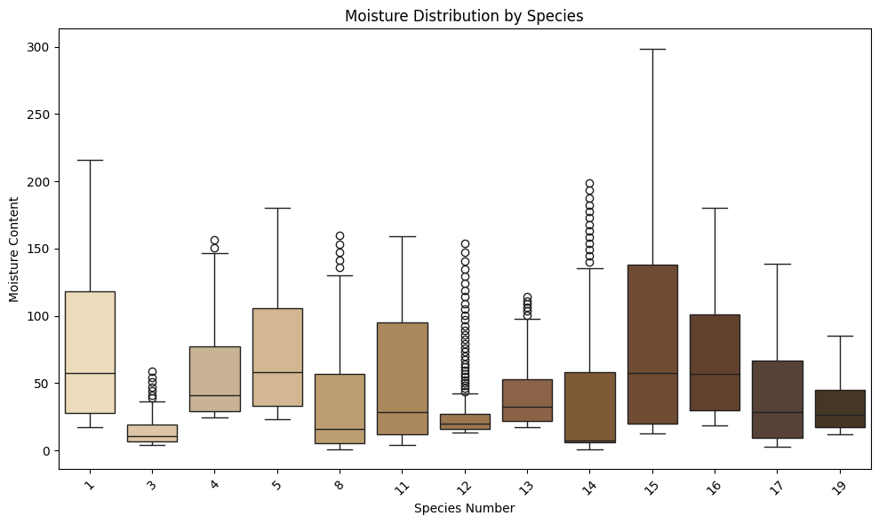
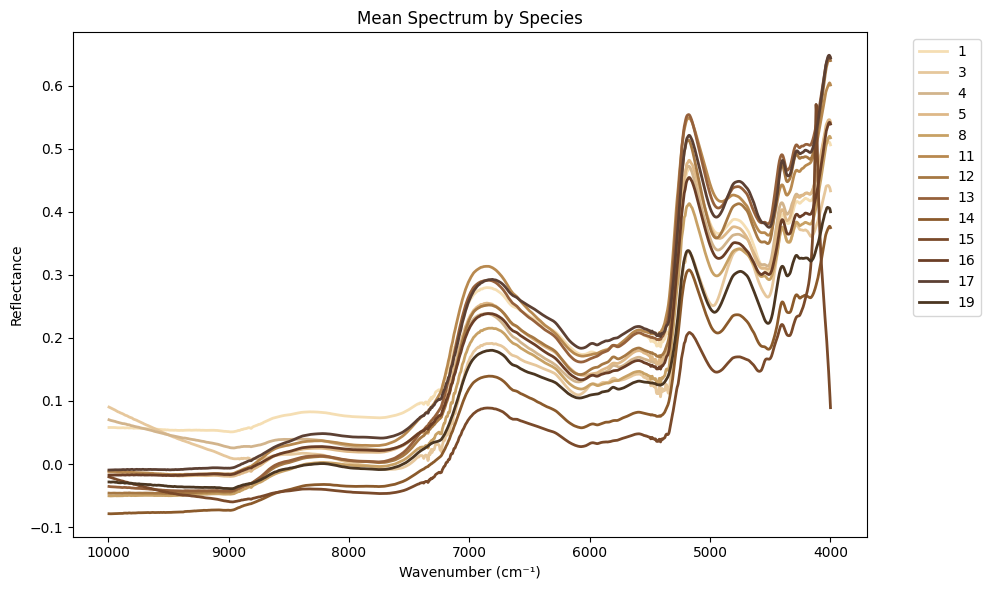
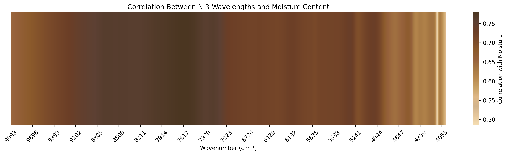
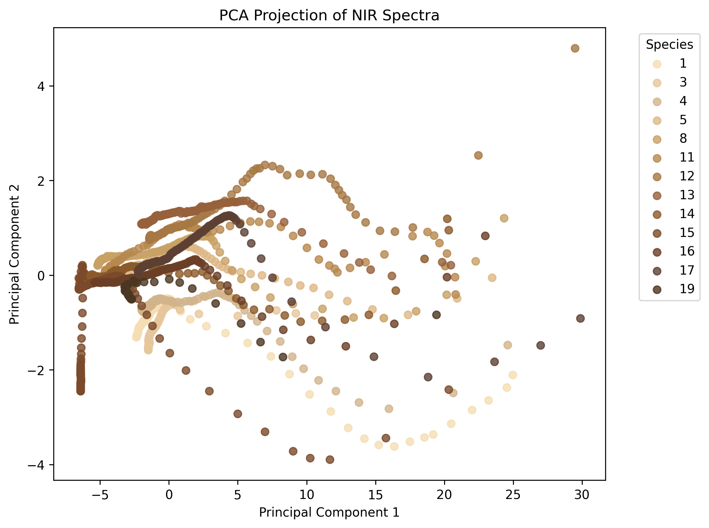
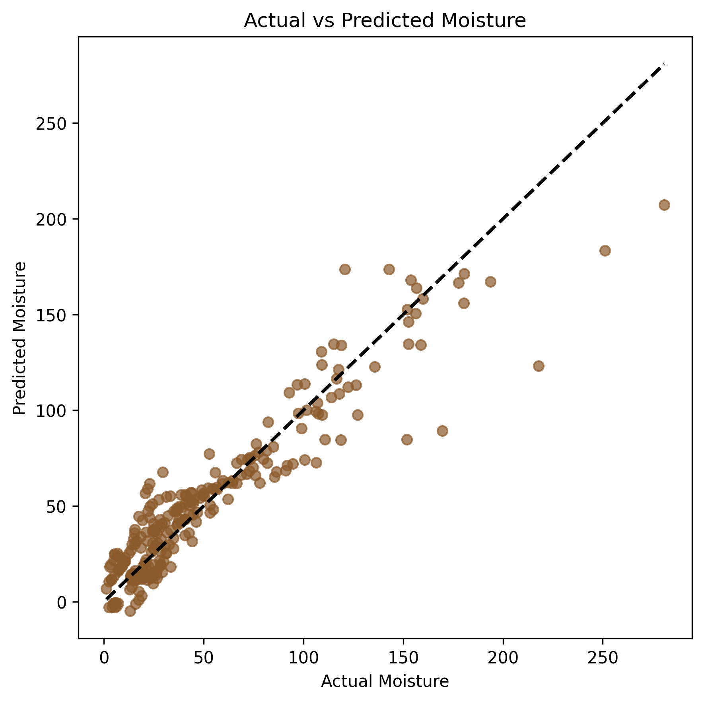

# NIR Spectroscopy Moisture Prediction

Machine learning project for predicting wood moisture content using Near-Infrared (NIR) spectroscopy data.

This project demonstrates a practical data science workflow including:

- Exploratory Data Analysis (EDA)
- Spectral data investigation
- Feature correlation analysis
- Dimensionality reduction
- Machine learning modeling

---

## Table of Contents

- Project Overview
- Dataset
- Repository Structure
- Exploratory Data Analysis
- Example Visualization
- Mean Spectrum
- Spectral Correlation With Moisture
- PCA Spectral Clusters
- Water Absorption Bands
- Model Results
- Prediction Performance
- Key Findings
- Future Work
- Technologies Used
- Author

---

## Project Overview

Near-Infrared (NIR) spectroscopy allows rapid and non-destructive measurement of material properties. In forestry and wood processing, it can be used to estimate moisture content from spectral signals.

In this project, spectral measurements from wood samples are analyzed to determine whether machine learning models can accurately predict moisture content.

Key challenges in the dataset include:

- High-dimensional spectral data (1555 wavelengths)
- Strong correlation between neighboring wavelengths
- Differences between wood species

---

## Dataset

The dataset contains NIR spectral measurements and corresponding moisture values.

| Feature | Description |
|------|------|
| Samples | 1322 wood samples |
| Spectral features | 1555 wavelengths |
| Wavenumber range | ~10000 – 4000 cm⁻¹ |
| Wood species | 13 |
| Target variable | Moisture Content |

Each row represents a wood sample, while each spectral column represents reflectance at a specific wavenumber.

---
<!--

## Repository Structure

NIR-Spectroscopy-Moisture-Prediction
│
├── data
│   └── raw dataset files
│
├── notebooks
│   └── 01_EDA.ipynb
│
├── docs
│   ├── eda_en.md
│   ├── eda_ja.md
│   ├── moisture_by_species.png
│   ├── mean_spectrum.png
│   ├── moisture_correlation_heatmap.png
│   ├── pca_spectral_clusters.png
│   └── prediction_results.png
│
├── src
│   └── future modeling code
│
└── README.md

---
-->

## Exploratory Data Analysis

Exploratory analysis was conducted to understand the structure of the dataset and identify patterns in the spectral measurements.

The analysis focused on:

- Distribution of moisture values across samples
- Differences in moisture between wood species
- Correlation between spectral wavelengths and moisture content
- Redundancy among spectral features

Detailed EDA documentation is available in the project documentation folder:

- English: docs/eda_en.md  
- Japanese: docs/eda_ja.md

---

## Moisture Distribution by Species

The following box plot shows how moisture content varies across different wood species in the dataset.

Moisture Distribution by Species

The visualization highlights differences in moisture ranges and variability between species, suggesting that species may influence moisture content and should be considered during modeling.

---
## Mean Spectrum

The figure below shows the average Near-Infrared (NIR) spectrum across all wood samples.

Mean Spectrum

The spectrum follows a smooth curve with noticeable absorption patterns. The x-axis is displayed in decreasing order (high to low wavenumber), which is standard in spectroscopy.

These patterns help identify regions of the spectrum that may be important for predicting moisture content.

---

## Spectral Correlation With Moisture

The heatmap below shows the correlation between each spectral wavelength and moisture content.

Spectral Correlation

Most wavelengths show moderate correlation with moisture, while neighboring wavelengths are highly correlated with each other. This indicates redundancy in the spectral features and suggests that dimensionality reduction or regularization techniques will be useful for modeling.

---

## PCA Spectral Clusters

Principal Component Analysis (PCA) reduces the high-dimensional spectral data into two components for visualization.

PCA Spectral Clusters

Each point represents a sample, colored by species number. The plot shows that samples begin to cluster based on spectral similarity, indicating that the spectral data contains meaningful structure that can be used for modeling.

---

## Prediction Performance

The scatter plot below compares predicted moisture values against actual measurements from the test set.

Prediction Performance

Points closer to the diagonal line indicate more accurate predictions. This visualization provides a quick assessment of how well the model is performing.

---

## Model Results

A baseline machine learning model was trained using Ridge Regression.

| Model | RMSE | R² |
|------|------|------|
| Ridge Regression | 16.886337190788044 | 0.8733314376848649 |

The dataset was split into training and testing sets using an 80/20 ratio.

These results provide a baseline for future improvements using more advanced models and feature engineering techniques.

---

## Key Findings

- Moisture values range from approximately 0.84 to 298.58
- Moisture distribution varies significantly across wood species
- Spectral wavelengths show moderate correlation with moisture content
- Neighboring wavelengths are highly correlated, indicating redundancy

These observations suggest that regularization techniques or dimensionality reduction methods will be effective for building predictive models.

---

## Future Work

Planned next steps for improving the model:

- Feature preprocessing and scaling
- Dimensionality reduction (PCA / PLS)
- Comparison of multiple regression models
- Hyperparameter tuning
- Model validation using cross-validation

These steps will help improve model accuracy and robustness.

---

## Technologies Used

- Python
- pandas
- numpy
- matplotlib
- seaborn
- scikit-learn
- Jupyter Notebook

---

## Author

Maggie Smith  
Junior Data Analyst  

This repository is part of a portfolio project demonstrating applied data analysis and machine learning techniques using spectroscopy data.
